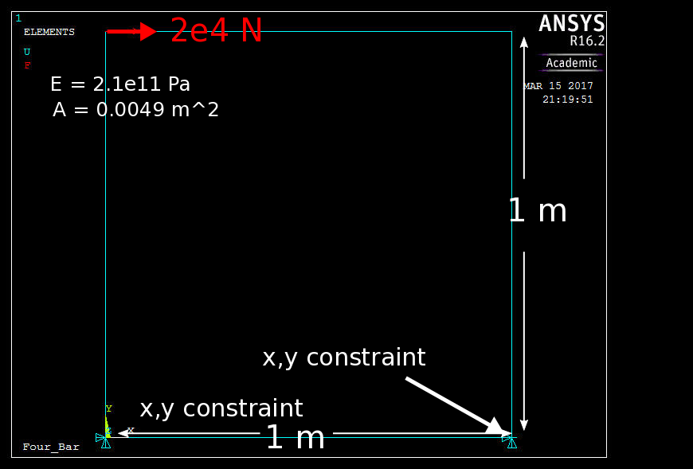
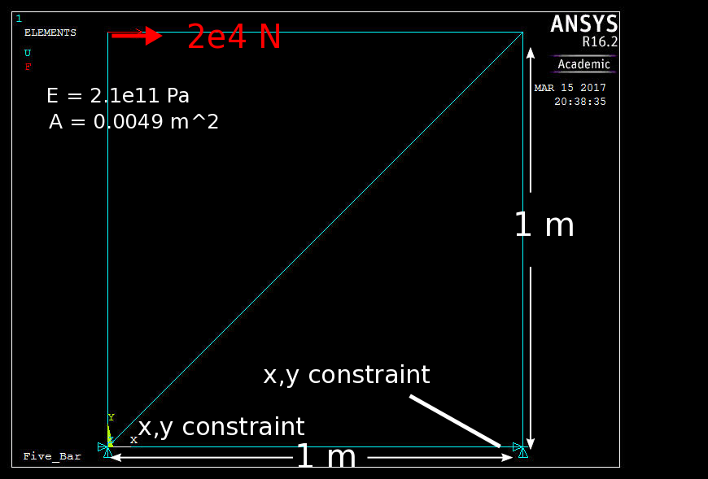
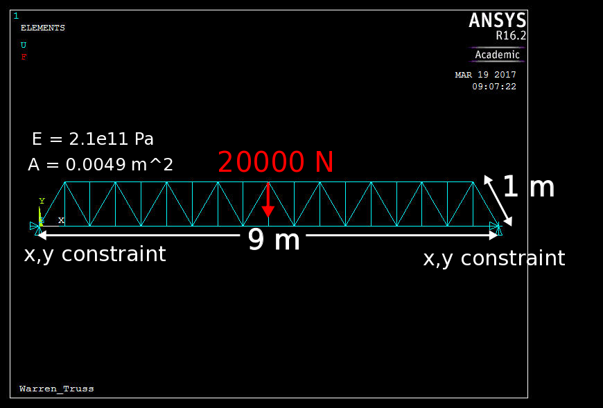

# TrussFEM
This program is an implementation of a bar finite element code in C++ that is appropriate for static equilibrium computations on truss structures. A global stiffness matrix is computed using the connectivity pattern and locations of the bar elements, as well as each element's cross-sectional area, length, and elastic modulus. The x,y displacement of each node in the truss are determined by solving Ku=F, where F are the applied forces, u are the displacements, and K is the global stiffness matrix. Using these displacements, the stresses and strains are determined in each bar element. Constraints are enforced using the penalty method. This program was written as a final project for ME 309 at Stanford University, winter quater 2017.  

All code is available at https://github.com/josephgreer/TrussFEM.

## Table of Contents ##
* External Dependencies
* Basic command-line usage  
* Explanation of input file formats
	* Materials defintion file
	* Node definition file
	* Element definition file
	* Boundary Condition definition file
* Examples
	* Three Bar with three degree of freedom (DOF) constraints (with nodal method verification)
	* Illformed Four Bar with four degree of freedom (DOF) constraints
	* Mechanically Indeterminate Five Bar Structure
	* Warren Truss Structure  

## External Dependencies ##
* [Armadillo](http://arma.sourceforge.net/)  for linear algebra support.
* [LAPACK](http://icl.cs.utk.edu/lapack-for-windows/lapack/) for linear algebra support.

## Command-Line Usage ##
To use this program from the command line, navigate to the folder containing TrussFEM.exe and type the following:  

**TrussFEM.exe materialPath nodePath elementPath boundaryConditionsPath outFileNamePath**  
  
materialPath, nodePath, elementPath, boundaryConditionsPath are paths to text files describing the geometry, materials, and boundary conditions used to solve the truss problem. Their formats are described below.  
outFileNamePath is the base path to which the FEM output should be written.

## Input File Formats ##
### Material Definition File ###
Material file is the following format:  

**[id_1  A_1   E_1;  
  id_2  A_2   E_2;  
   ...  
 id_MM A_MM  E_MM]**  
where **id_i** is material i's unique integer id, **A_i** is the cross-sectional area of the material and **E_i** is the material's young's modulus.

### Node Definition File ###
Node file is the following format:  
**[id_1  x_1   y_1;  
 id_2  x_2   y_2;  
 ...  
 id_N  x_N   y_N]**  
where **id_i** is node i's unique integer id, **x_i**, **y_i** are node i's coordinates

### Element Definition File ###
Element file is the following format:  
**[id_1  nid_11    nid_12    mid_1;  
 id_2  nid_21    nid_22    mid_2;  
 ...  
 id_M  nid_M1    nid_M2    mid_N]**    
where **id_i** is element i's unique integer id, **nid_i1**, **nid_12** are the two nodes comprising the elemnt, and **mid_i** is the integer id of the element

### Boundary Condition Definition File ###
Boundary condition file is the following format:  
**[nid_1 t_1 v_1x v_1y;  
 nid_2 t_2 v_2x v_2y;  
 ...  
 nid_NN t_NN v_NNx v_NNy]**    
where **nid_i** is the node id to which boundary condition i applies.  
**t_i** is the type of boundary condition i is. **t_i = 1** is a position constraint on node i. **t_i = 2** is a force input on node i  
**v_ix** and **v_iy** are the values of the boundary condition and their interpetation depends on **t_i**.  
If **t_i** is 1 (i.e. a DOF constraint), then **v_ix = 1** implies that node i is constrained in the x direction, similarly for v_iy. Otherwise these DOFs are unconstrained.  
If **t_i** is 2 (i.e. a force input), then **v_ix** is the x component of the force acting on node i and **v_iy** is the y component of the force acting on node i.  

## Example Test Cases with Verification from Ansys APDL
The following examples are designed to illustrate the use of the TrussFEM program through its calculation of several canonical truss examples. In addition, the same problem is run in Ansys to provide extra clarity as well as demonstrate agreement between TrussFEM and Ansys APDL.  
All example files are available at https://github.com/josephgreer/TrussFEM/tree/master/Examples

### Three Bar with three degree of freedom (DOF) constraints ###
This test case consists of a simple three bar with three DOF constraints and a force applied to the top node. Here is an image of the geometry in Ansys (through which the solution was verified).  

To run this problem in TrussFEM.exe, we need to specify the appropriate node, element, material, and boundary condition definition files.  

The four definition files are shown below. The column labels are included for convenience and are not in the actual file. 
**Nodes.txt**  
**ID	X	Y**  
**0	0	0**  
**1	0.5	0.866**  
**2	1	0**  

**Materials.txt**  
**ID	A	E**  
**0	0.0049	2.1e11**  
**1	0.01	2.1e11**  
**2	0.05	2.1e11**  

**Elements.txt**  
**ID	N1	N2	MID**  
**0	0	1	0**  
**1	1	2	1**  
**2	0	2	2**  

**BoundaryConditons.txt**  
**NID      Type     V1        V2**  
**0	1	1	1**  
**2	1	0	1**  
**1	2	20000	0**  

Here is the output from TrussFEM.  
######################################################  
Element results  
######################################################  
Element Id = 0, Strain = 0.000019 Stress = 4081542.856155  
Element Id = 1, Strain = -0.000010 Stress = -1999955.999516  
Element Id = 2, Strain = 0.000001 Stress = 200000.000000  
######################################################  
End Element results  
######################################################  

######################################################  
Node results  
######################################################  
Node Id = 0, Strain = 0.000010, Stress = 2140771.428078, ux = 0.000000, uy = 0.000000, Rx = -20000.000000, Ry = -17320.000000  
Node Id = 1, Strain = 0.000005, Stress = 1040793.428320, ux = 0.000029, uy = 0.000005, Rx = 0.000000, Ry = -0.000000  
Node Id = 2, Strain = -0.000004, Stress = -899977.999758, ux = 0.000001, uy = -0.000000, Rx = -0.000000, Ry = 17320.000000  
######################################################  
End Node results  
######################################################  

  
Note that the nodal stresses and strains are calculated by averaging elements that are connected to the relevant node.

**Nodal method verification:**    
Let F1, F2, F3 be the forces in elements 1, 2, and 3 respectively. And let R1x,R1y,R3y the reaction forces.

Equilibrium gives:    
F1\*cos(240)+F2\*cos(300)+2e4 = 0  
F1\*sin(240)-F2\*sin(300) = 0  
F1\*cos(60)+F3\*cos(0) + R1x = 0  
F1\*sin(60)+F3\*sin(0) + R1y = 0  
F2\*cos(120)+F3\*cos(180) + R3x = 0  
F2\*sin(120)+F3\*sin(180) = 0   

solving for F1,F2,F3, we find that F1 = 20000N, F2 = -20000N, F3 = 10000N. Dividing by the surface areas of the sections, we find that the stresses match the output of TrussFEM to within a few percent:  
**F1/A1 = 4081632.65 Pa, F2/A2 = -2000000.0 Pa, F3/A3 = 200000.0 Pa**

### Illformed Four Bar with four degree of freedom (DOF) constraints ###
This test case consists of a four bar structure with a force applied at the top. In this case, due to the geometry of the structure, we do not expect that the sustain the loads applied. In simpler terms, we expect the simulation to fail. Here is an image of the geometry in Ansys (through which the solution was verified).  

To run this problem in TrussFEM.exe, we need to specify the appropriate node, element, material, and boundary condition definition files.  

The four definition files are shown below. The column labels are included for convenience and are not in the actual file.
**Nodes.txt**  
**ID	X	Y**  
**0	0	0**  
**1	0	1**  
**2	1	1**  
**3	1	0**  

**Materials.txt**
**ID	A	E**  
**0	0.0049	2.1e11**  

**Elements.txt**    
**ID	N1	N2	MID**  
**0	0	1	0**  
**1	1	2	0**  
**2	2	3	0**  
**3	0	3	0**  

**Bcs.txt**  
**NID      Type     V1        V2**  
**0	1	1	1**  
**3	1	1	1**   
**1	2	5	0**  
**2	2	0	5**  

Here is the corresponding log file for Ansys APDL:  
**/Clear, Start**   
**/FileName, Four_Bar**  
**/Title, Four_Bar**  

**/PREP7**  
**ET,1,LINK180**  

**N, 1, 0, 0**  
**N, 2, 0, 1**  
**N, 3, 1, 1**  
**N, 4, 1, 0**  

**MPTEMP,,,,,,,,**  
**MPTEMP,1,0**    
**MPDATA,EX,1,,211e9**    

**R,1,0.0049, ,0**    

**E, 1, 2**  
**E, 2, 3**  
**E, 3, 4**  
**E, 1, 4**  

**F,2,FX,2e4**  

**D,1, , , , , ,ALL, , , , ,**   
**D,4, , , , , ,ALL, , , , ,**   

**/SOL**  
**/STATUS,SOLU**  
**SOLVE**     

**/POST1**    
**SET,FIRST**   

**PRNSOL,U,COMP**     

Here is the output from TrussFEM.   
**Stiffness matrix is ill-conditioned for solving (condition number = 78870734298562640). Verify there are enough constraints.**  
As expected, TrussFEM throws an error. It detects that the condition number fo the stiffness matrix is too high (indicating that inverting it is unstable) and warns the user that their problem may be malformed.

Ansys APDL also fails to solve the problem.

### Mechanically Indeterminate Five Bar Structure ###
This test case consists of a five bar truss that is mechanically indeterminate so that the nodal method fails to provide a soltuion. Here is an image of the geometry in Ansys (through which the solution was verified).  

To run this problem in TrussFEM.exe, we need to specify the appropriate node, element, material, and boundary condition definition files.  

The four definition files are shown below. The column labels are included for convenience and are not in the actual file.
**Nodes.txt**  
**ID	X	Y**  
**0	0	0**  
**1	0	1**  
**2	1	1**  
**3	1	0**  

**Materials.txt**
**ID	A	E**  
**0	0.0049	2.1e11**  

**Elements.txt**    
**ID	N1	N2	MID**  
**0	0	1	0**  
**1	1	2	0**  
**2	2	3	0**  
**3	0	3	0**  
**4	0	2	0**  

**Bcs.txt**  
**NID      Type     V1        V2**  
**0	1	1	1**  
**3	1	1	1**  
**1	2	2e4	0**  

Here is the corresponding log file for Ansys APDL:  
**/Clear, Start**   
**/FileName, Four_Bar**  
**/Title, Four_Bar**  

**/PREP7**  
**ET,1,LINK180**  

**N, 1, 0, 0**  
**N, 2, 0, 1**  
**N, 3, 1, 1**  
**N, 4, 1, 0**  

**MPTEMP,,,,,,,,**  
**MPTEMP,1,0**    
**MPDATA,EX,1,,211e9**    

**R,1,0.0049, ,0**    

**E, 1, 2**  
**E, 2, 3**  
**E, 3, 4**  
**E, 1, 4**  
**E, 1, 3**  

**F,2,FX,2e4**  

**D,1, , , , , ,ALL, , , , ,**   
**D,4, , , , , ,ALL, , , , ,**   

**/SOL**  
**/STATUS,SOLU**  
**SOLVE**     

**/POST1**    
**SET,FIRST**   

**PRNSOL,U,COMP**     

Here is the output from TrussFEM.   
**######################################################**  
**Element results**  
**######################################################**  
**Element Id = 0, Strain = -0.000000 Stress = -0.000000**  
**Element Id = 1, Strain = -0.000019 Stress = -4081632.653061**  
**Element Id = 2, Strain = -0.000019 Stress = -4081632.653061**  
**Element Id = 3, Strain = -0.000000 Stress = -4191.374152**  
**Element Id = 4, Strain = 0.000027 Stress = 5772300.254584**  
**######################################################**  
**End Element results**  
**######################################################**  

**######################################################**  
**Node results**  
**######################################################**  
**Node Id = 0, Strain = 0.000009, Stress = 1922702.960144, ux = 0.000000, uy = 0.000000, Rx = -19979.462267, Ry = -20000.000000**  
**Node Id = 1, Strain = -0.000010, Stress = -2040816.326531, ux = 0.000094, uy = 0.000000, Rx = 0.000000, Ry = -0.000000**  
**Node Id = 2, Strain = -0.000004, Stress = -796988.350513, ux = 0.000074, uy = -0.000019, Rx = 0.000000, Ry = -0.000000**  
**Node Id = 3, Strain = -0.000010, Stress = -2042912.013607, ux = 0.000000, uy = -0.000000, Rx = -20.537733, Ry = 20000.000000**  
**######################################################**  
**End Node results**  
**######################################################**  

These outputs were verified to match Ansys to within a few percent error.

### Warren Truss Structure ###
This test case consists of a warren truss structure that consists of 36 nodes and 69 elements. Here is an image of the geometry in Ansys (through which the solution was verified).  

Both the TrussFEM definition files and Ansys log file are available at: https://github.com/josephgreer/TrussFEM/tree/master/Examples/Warren_Truss

The output of TrussFEM was verified to match that of Ansys.

