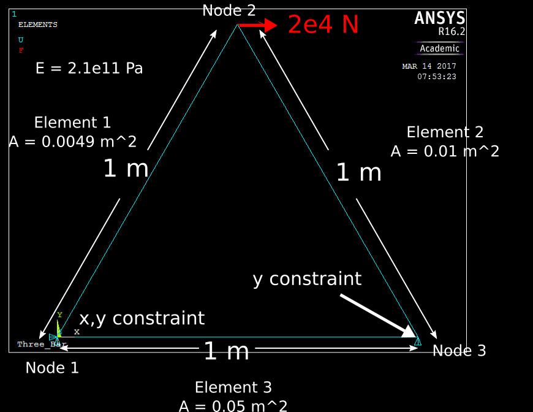

# TrussFEM
Basic implementation of a bar finite element code appropriate for static equilibrium computations of truss structures. Implemented as final project for ME 309 at Stanford, winter quater 2017.

## External Dependencies ##
* [Armadillo](http://arma.sourceforge.net/)  for linear algebra support.
* [LAPACK](http://icl.cs.utk.edu/lapack-for-windows/lapack/) for linear algebra support.

## Command-Line Usage ##
TrussFEM.exe materialPath nodePath elementPath boundaryConditionsPath outFileNamePath
materialPath, nodePath, elementPath, boundaryConditionsPath are paths to text files describing the geometry, materials, and boundary conditions used to solve the truss problem. Their formats are described below.  
outFileNamePath is the base path to which the FEM output should be written.

## Input File Formats ##
### Material Definition File ###
Material file is the following format:  

**[id_1  A_1   E_1;  
  id_2  A_2   E_2;  
   ...  
 id_MM A_MM  E_MM]**  
where **id_i** is material i's unique integer id, **A_i** is the cross-sectional area of the material and **E_i** is the material's young's modulus.

### Node Definition File ###
Node file is the following format:  
**[id_1  x_1   y_1;  
 id_2  x_2   y_2;  
 ...  
 id_N  x_N   y_N]**  
where **id_i** is node i's unique integer id, **x_i**, **y_i** are node i's coordinates

### Element Definition File ###
Element file is the following format:  
**[id_1  nid_11    nid_12    mid_1;  
 id_2  nid_21    nid_22    mid_2;  
 ...  
 id_M  nid_M1    nid_M2    mid_N]**    
where **id_i** is element i's unique integer id, **nid_i1**, **nid_12** are the two nodes comprising the elemnt, and **mid_i** is the integer id of the element

### Boundary Condition Definition File ###
Boundary condition file is the following format:  
**[nid_1 t_1 v_1x v_1y;  
 nid_2 t_2 v_2x v_2y;  
 ...  
 nid_NN t_NN v_NNx v_NNy]**    
where **nid_i** is the node id to which boundary condition i applies.  
**t_i** is the type of boundary condition i is. **t_i = 1** is a position constraint on node i. **t_i = 2** is a force input on node i  
**v_ix** and **v_iy** are the values of the boundary condition and their interpetation depends on **t_i**.  
If **t_i** is 1 (i.e. a DOF constraint), then **v_ix = 1** implies that node i is constrained in the x direction, similarly for v_iy. Otherwise these DOFs are unconstrained.  
If **t_i** is 2 (i.e. a force input), then **v_ix** is the x component of the force acting on node i and **v_iy** is the y component of the force acting on node i.  

## Example Test Cases with Verification from Ansys APDL
The following examples are designed to illustrate the use of the TrussFEM program through its calculation of several canonical truss examples. In addition, the same problem is run in Ansys to provide extra clarity as well as demonstrate agreement between TrussFEM and Ansys APDL.

### Three Bar with three degree of freedom (DOF) constraints ###
This test case consists of a simple three bar with three DOF constraints and a force applied to the top node.

To run this problem in TrussFEM.exe, we need to specify the appropriate node, element, material, and boundary condition definition files.  

The four definition files are shown below. The column labels are included for convenience and are not in the actual file. 
**Nodes.txt**  
**ID	X	Y**  
**0	0	0**  
**1	0.5	0.866**  
**2	1	0**  

**Materials.txt**  
**ID	A	E**  
**0	0.0049	2.1e11**  

**Elements.txt**  
**ID	N1	N2	MID**  
**0	0	1	0**  
**1	1	2	0**  
**2	2	3	0**  
**3	0	3	0**  
**4	0	2	0**  

**BoundaryConditons.txt**  
**NID      Type     V1        V2**  
**0	1	1	1**  
**2	1	0	1**  
**1	2	20000	0**  

Here is the corresponding log file for Ansys APDL:
**/Clear, Start**   
**/FileName, Three_Bar**  
**/Title, Three_Bar**  

**/PREP7**  
**ET,1,LINK180**  

**N, 1, 0**  
**N, 2, 1/2, sqrt(3)/2**  
**N, 3, 1, 0**  

**MPTEMP,,,,,,,,**   
**MPTEMP,1,0**  
**MPDATA,EX,1,,211e9**  

**R,1,0.0049, ,0**  

**E, 1, 2**  
**E, 2, 3**  
**E, 1, 3**
 
**F,2,FX,2e4**  

**D,1, , , , , ,ALL, , , , ,**   
**D,3, UY, 0, , , , , , , , ,** 

**/SOL** 
**/STATUS,SOLU**  
**SOLVE**     

**/POST1**    
**SET,FIRST**    

**PRNSOL,U,COMP**         

Here is the output from TrussFEM.  
######################################################  
Element results  
######################################################  
Element Id = 0, Strain = 0.000019 Stress = 4081542.856155  
Element Id = 1, Strain = -0.000019 Stress = -4081542.856155  
Element Id = 2, Strain = 0.000010 Stress = 2040816.326531  
######################################################  
End Element results  
######################################################   

######################################################  
Node results  
######################################################  
Node Id = 0, Strain = 0.000015, Stress = 3061179.591343, ux = 0.000000, uy = 0.000000, Rx = -20000.000000, Ry = -17320.000000  
Node Id = 1, Strain = -0.000000, Stress = -0.000000, ux = 0.000044, uy = -0.000003, Rx = 0.000000, Ry = 0.000000  
Node Id = 2, Strain = -0.000005, Stress = -1020363.264812, ux = 0.000010, uy = -0.000000, Rx = 0.000000, Ry = 17320.000000  
######################################################  
End Node results  
######################################################  
  
Note that the nodal stresses and strains are calculated by averaging elements that are connected to the relevant node.  

